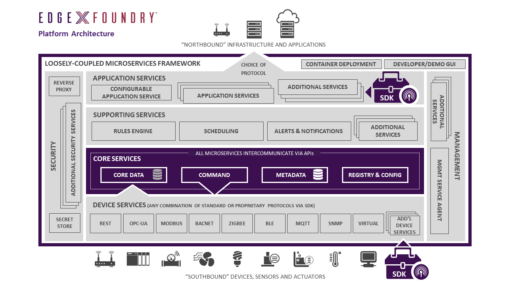
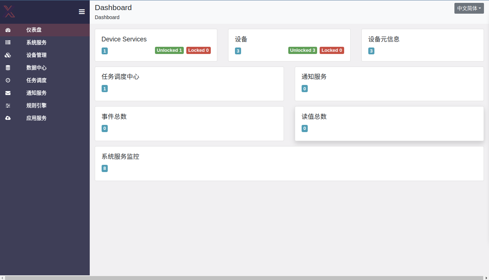

# 课题三物联网设备接入手册

课题三采用`EdgeX Foundry`作为物联网网关，容器化部署于边缘节点之上。EdgeX与设备接入及设备数据采集相关的服务分布于`CORE SERVICES`层及`DEVICE SERVICES`。

其中`CORE SERVICES`层负责保存设备元数据，设备注册，以及接收设备数据；`DEVICE SERVICES`提供各类物联网协议接口，用于沟通CORE SERVICES与具体接入的物联网设备，课题三目前仅实现对MQTT协议设备的支持。

有关`EdgeX Foundry`的详细信息，请参阅[EdgeX Foundry文档](https://docs.edgexfoundry.org/2.0/)。

如需向已部署的EdgeX网关接入新的物联网设备，可以通过`静态本地接入`或`远程接入`两种方式，下文将对这两种接入方式进行说明。



## 静态本地接入

静态本地接入即在课题三的边缘节点之上部署物联网设备，设备元数据、接入设备列表将在EdgeX Foundry启动/重启时自动加载，设备数据可以通过虚拟设备脚本自动生成。

该接入模式优点在于设备数据无需通过互联网接入部署于东南大学校园网内的EdgeX Foundry网关之上，且可以在物联网系统重启后自动读取设备配置数据并载入，无需重复配置。

静态本地接入需要提供以下配置文件：

`1. 设备元数据文件`

该文件用以描述某一种物联网设备的信息，包含设备名、生产商、型号等基本信息，以及设备支持的资源（资源是对设备能力的概括，比如设备支持的输入，设备产生的数据等）、对设备资源的操作。

- 样例配置文件：my.custom.device.profile.yml

```
# 设备名称
name: "my-custom-device-profile"
# 制造商
manufacturer: "iot"
# 型号
model: "MQTT-DEVICE"
# 描述
description: "Test device profile"
# 标签，用途由前端决定，目前无实际用途
labels:
  - "mqtt"
  - "test"
# 设备资源
deviceResources:
  -
    # 资源名
    name: randnum
    # 前端是否隐藏该资源，该项无关紧要
    isHidden: true
    # 资源描述
    description: "device random number"
    # 资源属性
    properties:
      # 资源值类型
      valueType: "Float32"
      # 资源可读/可写
      readWrite: "R"
  -
    name: ping
    isHidden: true
    description: "device awake"
    properties:
      valueType: "String"
      readWrite: "R"
  -
    name: message
    isHidden: false
    description: "device message"
    properties:
      valueType: "String"
      readWrite: "RW"
  -
    name: json
    isHidden: false
    description: "JSON message"
    properties:
      valueType: "Object"
      readWrite: "RW"
      mediaType: "application/json"

# 设备命令
deviceCommands:
  -
    # 命令名
    name: values
    # 读命令/写命令
    readWrite: "R"
    # 前端是否隐藏该命令，该项无关紧要
    isHidden: false
    # 资源操作
    resourceOperations:
        # 执行randnum、ping、message资源操作
        - { deviceResource: "randnum" }
        - { deviceResource: "ping" }
        - { deviceResource: "message" }
```

以上样例文件仅用于理解元数据文件的配置内容，目前前端演示系统仅展示采集到的设备数据，因此实际部署的设备元数据文件较为简易。

- 实际部署的设备元数据文件：pm-device-profile
```
# PM2.5检测设备
name: "pm-device-profile"
manufacturer: "RYSIM"
model: "MQ135"
description: "RYSIM PM2.5 device profile"
labels:
  - "mqtt"
deviceResources:
  -
    # 测试设备活性，当执行该资源操作后，设备应返回"pong"字符串，表明设备活跃，但该资源并未在前端展示，仅用于调试
    name: ping
    isHidden: true
    description: "device liveness probe"
    properties:
      valueType: "String"
      readWrite: "R"
  - 
    # 设备产生的PM2.5检测值，该值并不需要EdgeX网关主动读取，而是由设备周期性产生，并发布到对应的MQTT Topic中
    name: pmvalue
    isHidden: true
    description: "read pm value of sensor"
    properties:
      valueType: "String"
      readWrite: "R"
deviceCommands:
  -
    # 活性测试命令，前端并未展示，但是EdgeX会为之产生相应的API接口
    name: devicelivenessprobe
    readWrite: "R"
    isHidden: false
    resourceOperations:
        - { deviceResource: "ping" }
```

`2. 设备列表`

该文件描述系统中接入的物联网设备，每个设备需要关联到一个设备元数据对象。该文件会在网关启动时加载，以创建网关中的设备列表。

- 实际部署的设备列表文件：my.custom.device.config.toml
```
[[DeviceList]]
  # 设备名称
  Name = "temperature-sensor"
  # 元数据对象名
  ProfileName = "temperature-device-profile"
  # 设备描述
  Description = "vemsee温度传感器"
  # 设备标签
  Labels = [ "MQTT" ]
  # 协议相关配置
  [DeviceList.Protocols]
    [DeviceList.Protocols.mqtt]
       # EdgeX网关向该设备发布命令时所用的Topic
       CommandTopic = "CommandTopic"

[[DeviceList]]
  Name = "pm-sensor"
  ProfileName = "pm-device-profile"
  Description = "RYSIM PM2.5传感器"
  Labels = [ "MQTT" ]
  [DeviceList.Protocols]
    [DeviceList.Protocols.mqtt]
       CommandTopic = "CommandTopic"

[[DeviceList]]
  Name = "pressure-sensor"
  ProfileName = "pressure-device-profile"
  Description = "RYSIM 气压传感器"
  Labels = [ "MQTT" ]
  [DeviceList.Protocols]
    [DeviceList.Protocols.mqtt]
       CommandTopic = "CommandTopic"
```

`3. 设备脚本` 

设备脚本用于模拟实际的物联网设备产生数据。应为设备列表中的每个设备提供一个设备脚本文件。

- 设备脚本文件：mock-device-pm.js

```
var count = 0
function dataLoop(){
    let data = [26,24,27,29,31,33,34,33,31,30,30,29];
    return data[count++ % 12];
}
const deviceName = "pm-sensor";

// DataSender sends async value to MQTT broker every 15 min
schedule('*/15 * * * *', ()=>{
    let body = {
        "name": deviceName,
        "cmd": "pmvalue",
        "pmvalue": dataLoop()
    };
    publish( 'DataTopic', JSON.stringify(body));//DataTopic为EdgeX网关默认订阅的接收物联网设备数据的Topic。
});

// CommandHandler receives commands and sends response to MQTT broker
// 1. Receive the reading request, then return the response
// 2. Receive the set request, then change the device value
subscribe( "CommandTopic" , (topic, val) => {
    var data = val;
    if (data.method == "set") {
        switch(data.cmd) {
        }
    }else{
        switch(data.cmd) {
            case "ping":
              data.ping = "pong";
              break;
            case "pmvalue":
              data.pmvalue = 120.123;
              break;
          }
    }
    publish( "ResponseTopic", JSON.stringify(data));//EdgeX网关对设备的操作通过CommandTopic以及ResponseTopic实现，一般为网关主动向CommandTopic发布操作消息，并由设备接收；设备产生响应后将对应的返回消息发布于ResponseTopic，由网关接收。目前系统前端并未显示操作设备的相关逻辑，仅作调试用。
});
```

## 远程接入

设备的远程接入可以通过访问EdgeX Foundry网关的相应接口实现。

远程接入较为灵活，但是可能因为网络波动导致稳定性问题，因此建议最终演示的部署采用`静态本地接入`方案，远程接入方案可用于设备调试。

对于`设备元数据文件`、`设备列表文件`的部署，可以通过访问EdgeX Foundry的CORE METADATA服务实现：
```
POST http://{edgex-ip}:{core-metadata-service-port}/api/v2/deviceprofile
POST http://{edgex-ip}:{core-metadata-service-port}/api/v2/device
```
有关CORE METADATA API详情，请参阅[EdgeX Foundry - Core Metadata API](https://app.swaggerhub.com/apis-docs/EdgeXFoundry1/core-metadata/2.0.0#)。

此外，设备元数据和设备的创建也可以通过访问EdgeX网关的前端页面`http://{edgex-ip}:{edgex-ui-port}`手动完成。



`设备脚本文件`需要通过docker容器部署，请运行如下指令：

```
$ docker run -d --restart=always --name=mqtt-scripts -v {absolute path to scripts}:/scripts dersimn/mqtt-scripts --url mqtt://{mqtt-broker-ip}:{mqtt-broker-port} --dir /scripts
```
其中{ absolute path to scripts }指`设备脚本文件`所在目录的绝对路径，{ mqtt-broker-ip }、{ mqtt-broker-port }分别指mqtt-broker的ip及端口。

目前课题三系统的远程接入接口（mqtt-broker-ip、core-metadata-service-port、edgex-ui-port、mqtt-broker-port）暂未发布至公网，如有需要，可按需发布公网访问接口。